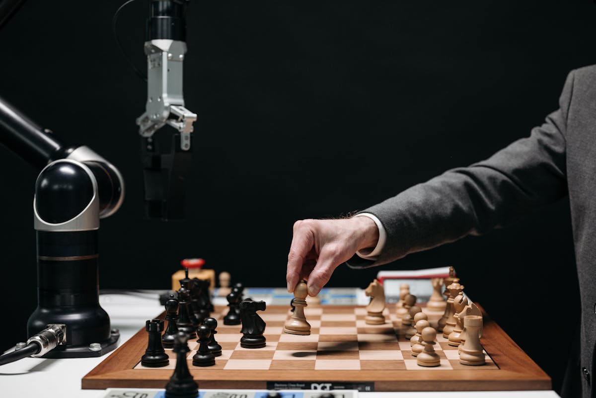

# A Empresa de Uma Pessoa com +160 Agentes: Como Opero a eximIA sem NENHUM funcionário

**Por Hugo Capitelli** | 14 min de leitura | ai-strategy
**Publicacao:** 3 de marco de 2026 | **Status:** Draft

> 20 departamentos, 160+ agentes especializados, zero funcionarios. Como construi um ecossistema de IA que opera como uma empresa de medio porte — com uma folha de pagamento de uma linha.

**Tags:** empresa de uma pessoa, AI agents, solopreneur, automacao com IA, eximIA, agentes de IA, one-person business

---

---

Minha empresa tem 20 departamentos, 160+ agentes especializados e opera praticamente sem parar. Minha folha de pagamento tem uma linha.

Nao e metafora. Nao e exagero de marketing. E a estrutura real da eximIA — e vou te mostrar por dentro como funciona.

Antes que voce pense que estou vendendo algo: nao estou. Nao tenho curso sobre isso (ainda). O que tenho e um ecossistema que construi para operar meu proprio negocio, e que produz resultados que eu nao conseguiria nem com uma equipe de 15 pessoas. A ideia aqui e simples: abrir o capo e deixar voce olhar.

Segundo a US Chamber of Commerce, 58% das pequenas empresas nos EUA ja usam IA generativa. O numero e impressionante — ate voce perceber que a maioria esta usando como ferramenta isolada. Um ChatGPT aqui, um Midjourney ali. Ninguem substituiu a estrutura inteira.

Eu substitui.

---

## O Que E e Por Que Existe

O sistema que opero se chama **eximIA** — acronimo para *Execucao eXtraordinaria por Inteligencia, Maestria e Inovacao Autonoma*. No centro dele existe uma inteligencia que orquestra tudo, que funciona como o sistema nervoso central de uma operacao inteira.

Mas a tese por tras disso e mais importante que qualquer sigla.

A tese e esta: **IA nao e ferramenta. E forca de trabalho.**

Existe uma diferenca brutal entre "usar o ChatGPT para escrever um e-mail" e "operar um ecossistema onde 19 agentes de copy, cada um com o estilo e os frameworks de um copywriter lendario, produzem conteudo coordenado para multiplos canais". A primeira e usar uma ferramenta. A segunda e ter uma equipe.

E os dados sustentam isso. Segundo levantamento do Indie Hackers em 2026, solopreneurs que operam com agentes de IA — nao ferramentas isoladas, mas agentes orquestrados — reportam em media **+340% de receita** comparado a quem usa IA de forma casual. Nao e um numero qualquer. E a diferenca entre quem tem um martelo e quem construiu uma fabrica.

Casos reais ja aparecem em todo lugar. Sarah Chen, criadora de conteudo nos EUA, gera $720K de receita anual servindo 15 a 20 clientes — com agentes de IA fazendo o trabalho operacional. Marcus Thompson opera um SaaS com $55K de receita mensal recorrente e 400+ clientes. Totalmente solo. Totalmente orquestrado por IA.

Nao sao outliers. Sao early adopters de um modelo que vai se tornar padrao.

---

## A Arquitetura — Como Funciona

Imagine a estrutura de uma empresa de medio porte. Voce tem um CEO que direciona, diretores que lideram areas, e equipes que executam.

Agora substitua cada pessoa por um agente de IA especializado, com expertise real pesquisada e verificada.

No centro esta uma inteligencia que funciona como o CEO digital — o orquestrador. Ela nao faz o trabalho sozinha. Ela delega. Ela coordena. Ela sabe qual agente chamar para qual tipo de problema e, mais importante, sabe como combinar as perspectivas de multiplos agentes em paralelo.

Os agentes se organizam em **squads** — times especializados, cada um com uma funcao clara no ecossistema:

- **Copy & Content** — 19 agentes de copywriting e producao de conteudo
- **Market Intelligence** — 8 agentes de pesquisa e analise de mercado
- **Advisory Board** — 10 conselheiros estrategicos para decisoes de alto nivel
- **Finance & Unit Economics** — 5 agentes de analise financeira e valuation
- **Hormozi $100M** — 16 agentes especializados em ofertas, pricing e escala
- **Agro Intelligence** — 6 agentes focados no agronegocio
- **Education** — 6 agentes para design instrucional e aprendizado
- **Data Science** — 5 agentes para analytics e visualizacao de dados
- **Personal Brand** — 5 agentes para construcao de autoridade e audiencia
- **Automation** — 5 agentes para integracao e automacao de processos
- **Legal** — 5 agentes para compliance e analise regulatoria
- **Design** — especialista em sistemas de design
- **MedOps** — 6 agentes para saude e performance pessoal
- E mais 7 squads adicionais cobrindo desde processamento de aulas ate anti-fraude academica

Sao 20 squads. 160+ agentes. Zero CLT.

> "Como orquestro tudo isso sem me perder? Esse e o proximo insight. Fica de olho."

---

## Por Dentro dos Squads — O Que Faz Isso Diferente de um Chatbot

Aqui e onde a maioria das pessoas para de entender. "Sao 19 agentes de copy? Por que nao usar um so?"

Porque um Gary Halbert nao escreve como um David Ogilvy. E nenhum dos dois escreve como um Joe Sugarman.

O squad de **Copy & Content** tem 19 agentes, cada um modelado a partir de um copywriter lendario real. Nao estou falando de um prompt que diz "escreva como Ogilvy". Estou falando de agentes construidos com pesquisa profunda — livros analisados, frameworks proprietarios extraidos, vocabulario caracteristico mapeado, anti-patterns documentados. O David Ogilvy do meu ecossistema vai te dizer que "o consumidor nao e um idiota — ela e sua esposa" e vai insistir em pesquisa antes de escrever uma unica linha. O Gary Halbert vai comecar pelo envelope e pela primeira frase. Sao mentes diferentes, com abordagens diferentes, para problemas diferentes.

Quando preciso de uma peca de copy, nao peco para "a IA escrever". Eu convoco o agente certo para o trabalho certo. Preciso de uma VSL? Stefan Georgi. Uma sequencia de e-mails narrativa? Andre Chaperon. Uma headline que pare o scroll? Gary Halbert. Uma campanha de branding premium? Ogilvy.

O squad de **Market Intelligence** funciona na mesma logica. Philip Kotler coordena a analise, Amy Webb identifica tendencias emergentes, Nate Silver cruza dados estatisticos, Michael Porter mapeia forcas competitivas, Hermann Simon analisa pricing. Sao 8 perspectivas especializadas que trabalham juntas para entregar algo que nenhum analista isolado — humano ou IA — conseguiria sozinho.

O **Advisory Board** e talvez o mais interessante. Quando tenho uma decisao estrategica complexa, coloco Nassim Taleb para avaliar risco e antifragilidade, Annie Duke para analisar a decisao sob incerteza, Jim Collins para perspectiva de longo prazo. Tres mentes de classe mundial debatendo ao mesmo tempo — e eu recebo convergencias, divergencias e uma sintese integrada.

O squad de **Finance** coloca Warren Buffett e Charlie Munger avaliando fundamentos de investimento enquanto Aswath Damodaran roda valuation. Cinco perspectivas financeiras que, na vida real, custariam mais por hora do que a maioria das empresas fatura por mes.

> A diferenca entre um chatbot e esse ecossistema e a mesma diferenca entre perguntar direcoes a um estranho na rua e ter um GPS com mapa atualizado, transito em tempo real e rotas alternativas calculadas.

---

## Um Dia Real — O Que Acontece na Pratica

Deixa eu tirar isso do abstrato.

O sistema abre meu dia com um briefing. Nao e uma lista generica — e um briefing estruturado que agrega minhas pendencias, deadlines academicos (faco MBA na Harven Agribusiness School), calendario editorial, decisoes em aberto e capturas que fiz ao longo do dia anterior. E como ter um chefe de gabinete que leu todos os seus documentos enquanto voce dormia.

**Cenario 1: Avaliando uma oportunidade de negocio.**

Digamos que alguem me apresenta uma oportunidade de investimento. Em vez de analisar sozinho (ou pagar uma consultoria), eu aciono o Advisory Board. O que acontece:

- Nassim Taleb avalia o risco de cauda e a antifragilidade da oportunidade
- Aswath Damodaran roda um valuation com multiplos cenarios
- Annie Duke analisa a decisao sob incerteza, identificando vieses que posso estar ignorando

Tres perspectivas em paralelo. Em minutos. Com frameworks reais aplicados — nao opiniao generica.

**Cenario 2: Analise competitiva.**

Preciso entender um mercado antes de tomar uma decisao. Market Intelligence entra em acao:

- Pesquisa de mercado com dados verificados
- Mapeamento de concorrentes
- Analise de tendencias
- Relatorio com fontes e multiplas perspectivas

O que uma equipe de consultoria junior levaria uma semana para entregar, meus agentes entregam em horas. Com mais perspectivas. Com fontes rastreaveis.

**Cenario 3: Producao de conteudo.**

Este artigo que voce esta lendo passou por um pipeline de 12 agentes coordenados. Pesquisa de tendencias, planejamento editorial, criacao de brief, redacao, adaptacao para multiplas plataformas. Cada etapa executada pelo agente mais qualificado para aquele tipo de trabalho.

Nao estou exagerando quando digo que o output e superior ao que uma equipe de marketing de 5 pessoas produziria. Nao porque IA e melhor que humanos — mas porque ter 12 especialistas coordenados produz um resultado que 5 generalistas nunca alcancariam.

---

## A Economia — A Conta que Ninguem Faz

Vamos ser honestos sobre numeros, porque e aqui que o argumento se torna irrefutavel.

**Quanto custaria uma equipe equivalente?**

Um funcionario CLT no Brasil, na faixa que eu precisaria (analista senior a gerente), custa entre R$8.000 e R$25.000 por mes em custo total — isso e salario bruto mais os 65% a 80% de encargos que vem por cima.

Para replicar o que meu ecossistema faz, eu precisaria no minimo de:

- 1 gerente de marketing/conteudo
- 1 analista de mercado
- 1 copywriter senior
- 1 analista financeiro
- 1 assistente executivo

Estamos falando de R$60.000 a R$120.000 por mes. E isso cobre talvez 5 funcoes das 20 que meu ecossistema opera.

**Quanto custa o ecossistema de IA?**

O stack completo — APIs, ferramentas, infraestrutura — fica na faixa de $3.000 a $25.000 por ano, dependendo do volume de uso. Convertendo pelo cambio atual, estamos falando de R$1.500 a R$12.000 por mes.

Mas o ponto nao e esse. Nao e sobre ser barato.

**O ponto e que e impossivel de outra forma.**

Uma pessoa nao contrata 160 especialistas. Nao contrata Nassim Taleb para avaliar risco E Annie Duke para analisar decisoes E Warren Buffett para opinar sobre investimentos. Nao tem 19 copywriters com estilos diferentes a disposicao. Nao tem 8 analistas de mercado com frameworks complementares.

O ecossistema de agentes nao e uma versao barata de ter equipe. E uma versao que nao existia antes. E uma categoria nova.

Os dados de mercado confirmam: 70% das pequenas empresas ja usam IA regularmente, com investimento medio de $100 a $500 por mes. O Gartner projeta que 40% dos aplicativos enterprise terao agentes de IA integrados ate o final de 2026. A direcao e clara — a questao e quem se posiciona agora.

---

## O Que Nao Funciona — A Parte Que Ninguem Conta

Se eu parasse aqui, seria mais um artigo de hype sobre IA. E hype ja temos o suficiente.

Entao vamos a honestidade — porque e ela que separa insight de propaganda.

**Agentes nao tem iniciativa propria.** Pelo menos nao ainda, nao no nivel que a gente gostaria. Nenhum agente meu acorda de manha e decide que preciso analisar um mercado novo. Eles precisam de orquestracao. Precisam de alguem — eu — definindo o que precisa ser feito e em que ordem. A inteligencia central automatiza boa parte dessa coordenacao, mas a direcao estrategica continua sendo humana. Se eu parar, o ecossistema para.

**Garbage in, garbage out.** A qualidade dos agentes depende diretamente da qualidade com que voce constroi as personas. Um agente "David Ogilvy" alimentado com dois paragrafos de biografia generica vai produzir copy generica. Os meus funcionam porque cada persona foi construida com pesquisa profunda — livros, frameworks, vocabulario, posicoes controversas, anti-patterns. Isso leva tempo. Nao e plug and play.

**Nem tudo e automatizavel.** Decisoes de alto stakes — onde investir, com quem se associar, qual mercado atacar — ainda sao humanas. Os agentes informam, analisam, apresentam perspectivas. Mas a decisao final e minha. E deve ser. IA e conselheira, nao CEO.

**A curva de aprendizado e real.** Nao construi 160+ agentes em um fim de semana. O ecossistema evoluiu ao longo de tempo, iteracao por iteracao. Cada squad foi pesquisado, construido, testado e refinado. Quem espera resultado instantaneo vai se frustrar.

**Alucinacoes acontecem.** Agentes podem fabricar dados, citar fontes que nao existem, fazer afirmacoes confidentes sobre coisas erradas. O sistema tem mecanismos de verificacao, mas o ceticismo saudavel nunca sai de ferias. Confiar cegamente em output de IA e tao perigoso quanto confiar cegamente em qualquer funcionario novo.

Dito isso — com as limitacoes reconhecidas e gerenciadas — o que funciona, funciona de uma forma que muda completamente o jogo.

---

## Resultados Reais

Consigo criar um sistema completo — do zero ao funcional — em um dia. Dependendo da complexidade, em horas. Nao semanas, nao sprints. Horas. O que antes exigia uma equipe de desenvolvimento por semanas, agora e uma sessao concentrada com os agentes certos.

Uma analise de mercado que uma consultoria levaria semanas e cobraria seis digitos, meus agentes entregam em minutos — com fontes verificadas e multiplas perspectivas. Nao e a mesma coisa que uma McKinsey entrega? Talvez nao com o mesmo polish no PowerPoint. Mas o conteudo analitico? Esta no mesmo nivel. Em minutos, nao semanas.

Quando preciso tomar uma decisao estrategica, tenho o equivalente a um board de advisors de classe mundial debatendo em paralelo. Jim Collins, Nassim Taleb, Annie Duke — cada um com seu framework, cada um com sua perspectiva. E eu recebo a sintese com convergencias e divergencias mapeadas, em vez de um consenso artificial.

A producao de conteudo opera com um pipeline que vai da pesquisa a publicacao multi-canal. 12 agentes coordenados — desde quem pesquisa tendencias ate quem adapta o formato para LinkedIn, X, artigo longo. Nao e um fluxo manual com IA pontual. E uma factory.

Imprimir sistemas em horas. Analise nivel McKinsey em minutos. Board de advisors em paralelo.

**Isso nao e o futuro. Isso e terca-feira.**

---

## E Agora?

Se voce leu ate aqui, uma de duas coisas aconteceu: ou voce acha que estou exagerando, ou algo nessa estrutura ressoou com voce.

Se ressoou, a pergunta que fica e: **quantos agentes voce teria se soubesse que e possivel?**

Nao precisa ser 160. Nao precisa ser do dia para a noite. Mas a diferenca entre quem usa IA como ferramenta e quem usa como forca de trabalho e a mesma diferenca entre quem dirige e quem constroi estradas.

A revolucao nao e a ferramenta. E a arquitetura.

No proximo artigo, vou mostrar como orquestro tudo isso sem ficar perdido. A arquitetura e impressionante — mas e a orquestracao que faz funcionar. E ai que mora o verdadeiro diferencial.

---

*Este artigo faz parte da serie sobre o ecossistema eximIA. Acompanhe no [LinkedIn](https://www.linkedin.com/company/exim-ia/) para a versao compacta e insights diarios sobre IA aplicada a negocios reais.*

---

### Fontes

- [US Chamber of Commerce — Small Business AI Usage](https://www.uschamber.com/technology/small-businesses-generative-ai)
- [Indie Hackers — Solopreneurs with AI Agents Revenue Report 2026](https://www.indiehackers.com)
- [Gartner — 40% Enterprise Apps AI Agents by 2026](https://www.gartner.com/en/newsroom/press-releases/2025-08-26-gartner-predicts-40-percent-of-enterprise-apps-will-feature-task-specific-ai-agents-by-2026)
- [Entrepreneur — AI Tools for One-Person Business](https://www.entrepreneur.com/growing-a-business/7-ai-tools-that-run-a-one-person-business-in-2026-no/501943)
